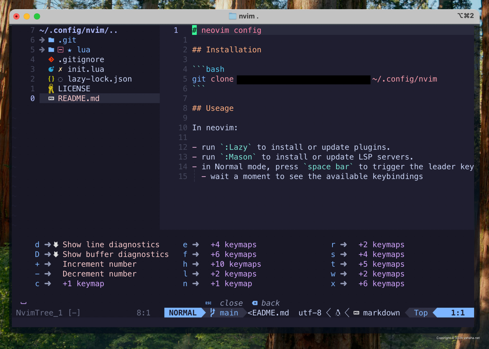

# neovim config

[English](README.md) | [简体中文](README.zh-CN.md) | [日本語](README.ja.md) | [Français](README.fr.md) | [한국어](README.ko.md)

Une configuration Neovim personnelle et moderne, écrite en Lua et gérée avec
[lazy.nvim](https://github.com/folke/lazy.nvim). LSP natif, Treesitter,
Telescope et un thème Catppuccin — tout est inclus, optimisé pour le
développement web et Python.



## Fonctionnalités

- ⚡ **Chargement paresseux** — plugins gérés par lazy.nvim avec un
  `lazy-lock.json` versionné pour des installations reproductibles
- 🧠 **LSP natif** — `nvim-lspconfig` + `mason.nvim`, serveurs et outils
  installés automatiquement
- ✨ **Complétion** — [blink.cmp](https://github.com/Saghen/blink.cmp), un moteur
  de complétion moderne et rapide
- 🌳 **Treesitter** — coloration syntaxique et sélection incrémentale, ainsi que
  des objets texte basés sur Treesitter
- 🔭 **Telescope** — recherche floue de fichiers, live grep, symboles LSP et todos
- 🎨 Thème **Catppuccin**, barre de statut `lualine`, tableau de bord `alpha`,
  aides `which-key` et guides d'indentation
- 🧹 **Formatage et lint à la sauvegarde** — `conform.nvim` (prettier / stylua /
  isort / black) et `nvim-lint` (eslint_d / pylint)
- 💾 **Session automatique** — restaure votre espace de travail par répertoire de
  projet
- 🔧 Intégration Git via `gitsigns` et `lazygit`

## Prérequis

- **Neovim** 0.10 ou plus récent
- **git**
- Une **Nerd Font** (pour les icônes ; la configuration suppose qu'elle est
  définie dans votre terminal)
- Un **terminal true color** (iTerm2, WezTerm, Kitty, etc.) — requis pour
  `termguicolors`
- **ripgrep** (`rg`) — pour le live grep de Telescope
- **Node.js** — requis par plusieurs serveurs LSP et formateurs (prettier, etc.)

## Installation

```bash
git clone git@github.com:dofy/nvim.git ~/.config/nvim
```

Puis lancez Neovim :

```bash
nvim
```

Au premier démarrage, lazy.nvim s'amorce lui-même et installe automatiquement
tous les plugins. Les serveurs LSP et les outils sont installés par Mason en
arrière-plan.

- Exécutez `:Lazy` pour installer / mettre à jour / nettoyer les plugins
- Exécutez `:Mason` pour gérer les serveurs LSP, les formateurs et les linters
- Appuyez sur `<Space>` (la touche leader) et patientez pour voir les
  raccourcis disponibles
- Appuyez sur `g?` pour afficher l'écran des raccourcis

## Structure

```
init.lua
├── lua/custom/core/
│   ├── options.lua     # réglages vim.opt
│   └── keymaps.lua     # raccourcis de base (leader = <Space>)
├── lua/custom/lazy.lua # amorçage lazy.nvim + import des plugins
└── lua/custom/plugins/
    ├── init.lua        # dépendances de base (plenary, vim-tmux-navigator)
    ├── lsp/
    │   ├── mason.lua       # Mason + mason-lspconfig + installateur d'outils
    │   └── lspconfig.lua   # nvim-lspconfig + raccourcis LspAttach
    └── *.lua           # un fichier par plugin
```

Pour ajouter un plugin, créez `lua/custom/plugins/<name>.lua` renvoyant une
table de spec lazy.nvim — elle est importée automatiquement.

## Plugins

| Catégorie | Plugins |
| --- | --- |
| Complétion | blink.cmp |
| LSP | nvim-lspconfig, mason.nvim, mason-lspconfig, mason-tool-installer |
| Syntaxe | nvim-treesitter, nvim-treesitter-textobjects |
| Fichiers et recherche | nvim-tree, telescope.nvim |
| Formatage et lint | conform.nvim, nvim-lint |
| Interface | catppuccin, lualine, alpha, dressing, indent-blankline, which-key |
| Édition | autopairs, substitute.nvim, todo-comments, trouble.nvim |
| Git | gitsigns, lazygit |
| Session et divers | auto-session, wakatime |

## Raccourcis

La touche leader est `<Space>`. Ceci est une référence rapide ; appuyez sur
`<leader>` ou `g` et patientez pour que `which-key` affiche la liste complète.

### Fenêtres et onglets

| Touche | Action |
| --- | --- |
| `<leader>sv` / `<leader>sh` | Diviser verticalement / horizontalement |
| `<leader>se` / `<leader>sx` | Égaliser les divisions / fermer la division |
| `<leader>to` / `<leader>tx` | Ouvrir / fermer un onglet |
| `<leader>tn` / `<leader>tp` | Onglet suivant / précédent |
| `<leader>tf` | Ouvrir le buffer courant dans un nouvel onglet |
| `<leader>nh` | Effacer la surbrillance de recherche |
| `jk` (insertion) | Quitter le mode insertion |

### Recherche (Telescope) et explorateur

| Touche | Action |
| --- | --- |
| `<leader>ff` | Trouver des fichiers dans le répertoire courant |
| `<leader>fr` | Fichiers récents |
| `<leader>fs` | Live grep dans le répertoire courant |
| `<leader>fc` | Grep de la chaîne sous le curseur |
| `<leader>ft` | Trouver les todos |
| `<leader>ee` | Basculer l'explorateur de fichiers |
| `<leader>ef` | Basculer l'explorateur sur le fichier courant |
| `<leader>ec` / `<leader>er` | Replier / rafraîchir l'explorateur |

### LSP

| Touche | Action |
| --- | --- |
| `gd` / `gR` | Définitions / références |
| `gD` / `gi` / `gt` | Déclaration / implémentations / définitions de type |
| `K` | Documentation au survol |
| `<leader>ca` | Actions de code |
| `<leader>rn` | Renommer le symbole |
| `<leader>d` / `<leader>D` | Diagnostics de ligne / de fichier |
| `[d` / `]d` | Diagnostic précédent / suivant |
| `<leader>rs` | Redémarrer le LSP |

### Édition

| Touche | Action |
| --- | --- |
| `s` + mouvement / `ss` / `S` | Substituer avec mouvement / ligne / jusqu'à la fin de ligne |
| `s` (visual) | Substituer la sélection |
| `<leader>fo` | Formater le fichier ou la plage |
| `<leader>ll` | Déclencher le lint |
| `<leader>wr` / `<leader>ws` | Restaurer / sauvegarder la session |

## LSP et formatage

**Serveurs LSP** (installés automatiquement via `mason-lspconfig`) : `ts_ls`,
`denols`, `html`, `cssls`, `tailwindcss`, `svelte`, `lua_ls`, `graphql`,
`emmet_ls`, `prismals`, `pyright`.

**Outils** (installés automatiquement via `mason-tool-installer`) : `prettier`,
`stylua`, `isort`, `black`, `pylint`, `eslint_d`.

**Formatage** — `conform.nvim`, exécuté à la sauvegarde (manuel : `<leader>fo`) :

- JS / TS / CSS / HTML / JSON / YAML / Markdown / GraphQL → prettier
- Lua → stylua (indentation de 2 espaces)
- Python → isort + black

**Lint** — `nvim-lint`, déclenché à l'entrée / la sauvegarde / la sortie du mode
insertion (manuel : `<leader>ll`) :

- JS / TS / Svelte → eslint_d
- Python → pylint

## Licence

[MIT](LICENSE)
